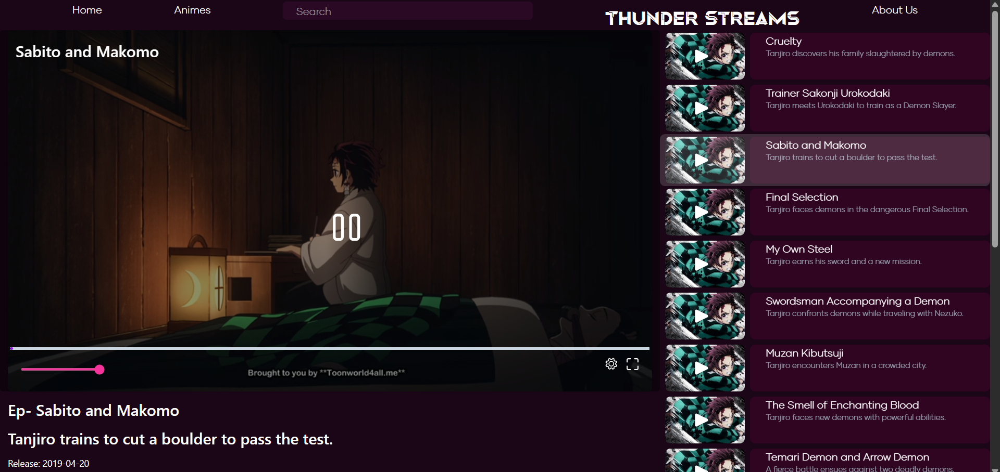

# Thunder Streams

It is an Anime Streaming Platform built in MERN Stack and consists of collection of latest anime shows and series from various genres.This repository consists of the source code of frontend or UI part of the application built using React.

The application is functional and can be viewed [ThunderStreams](https://thunderstreams-front.pages.dev)

Currently,This part of the app is deployed on **Cloudflare Pages**

The Backend repository is [here](https://github.com/ppomega/thunderstreams_back) along with complete architecture and logic.

# Image Previews

Any suggestions and contributions are welcomed.

**Note:-This app is not made for sales or commercial activites.It is just an implementation of Dash Streaming protocol and other concepts used in Web Development for VOD(Video on demand).**
